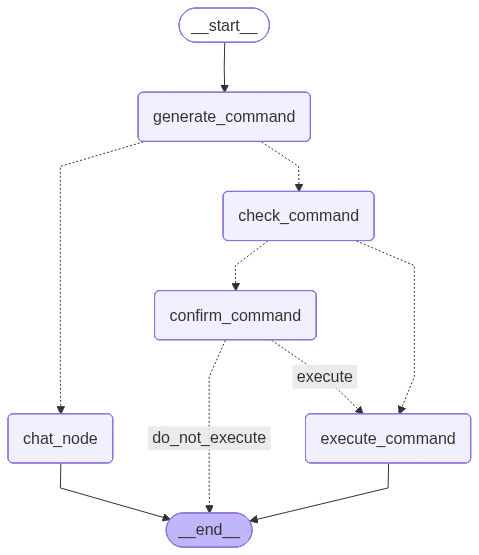

# Terminal Agent

> A powerful, native Windows application that translates natural language commands into actionable PowerShell commands or provides casual chat responses.

## Quick Start

Get running in less than 2 minutes!

```bash
# 1. Install Dependencies
pip install -r requirements.txt

# 2. Run the TUI Dashboard
python ui.py
```

*Note: The application will prompt you automatically for a Groq API key upon first run.*

---

## Features

- **Natural Language to PowerShell:** Ask it to "create a new folder named test" and it seamlessly translates it to `New-Item -ItemType Directory -Name "test"`.
- **Chat vs Command Routing:** Differentiates between system operations and casual conversation.
- **Safety First:** A strict safety check layer powered by both an LLM review and a comprehensive blacklist prevents execution of high-risk or destructive commands.
- **Human-in-the-Loop (HITL):** Before executing any flagged risky command, the agent halts and requests explicit user confirmation.
- **Rich Terminal UI (TUI):** Includes a visually pleasing and interactive TUI developed using Textual, featuring response animations, real-time command processing, and native aesthetic matching.
- **Persistent Context:** The `cwd` (Current Working Directory) is updated in real-time.
- **Extensible Architecture:** LangGraph-based framework makes the prompt flow modular and easy to extend.

---

## Configuration

You can configure the application using environment variables. 

| Variable | Description | Example |
|----------|-------------|---------|
| `GROQ_API_KEY` | Your Groq API key for LLaMA-3.3-70b-versatile access | `gsk_ABCXYZ` |

Create a `.env` file in the root directory to store your API key.

---

## Architecture Flow

The underlying logic is designed around a directed graph using LangGraph (`agent/graph.py`).



### Core Pipeline

1. **`generate_command`**: Evaluates the user's prompt (with LLM structural output) to determine intent ('chat' vs 'command') and builds the respective command or chat string.
2. **Intent Routing**: 
   - If `intent == "chat"`, it routes to `chat_node`.
   - If `intent == "command"`, it routes to `check_command`.
3. **`check_command`**: A secondary safety layer where the system checks the generated PowerShell command against:
   - A robust static `BLACKLIST` of restricted patterns.
   - An LLM-powered security review to evaluate operational risk dynamically.
4. **`confirm_command`**: If flagged as risky (`is_risky == True`), the workflow stalls for human approval.
5. **`execute_command`**: The approved (or safe) command is invoked via `subprocess.run()`, returning standard output and tracking state changes such as directory traversal.

---

## Project Structure

```text
terminal-agent/
├── main.py        # Lightweight, loop-based Command Line Interface.
├── ui.py          # Rich Textual Application serving as the primary frontend dashboard.
├── viz.py         # Lightweight script used for generating the workflow visualization.
└── agent/         # Core AI agent logic
    ├── graph.py   # LangGraph state machine mapping edges, paths, and flow conditions.
    ├── nodes.py   # Encapsulates logic for LLM operations, structured outputs, security evaluation.
    └── state.py   # Strongly-typed state definition handling attributes like cwd, text, intent.
```

---

## Development

- **Visualizing Workflows:** Execute `python viz.py` to regenerate the `graph.png` visualization.
- **Extending Security:** Refine the list of blocked items by updating the `BLACKLIST` array inside `agent/nodes.py`.

---

## Safety Disclaimer

> **⚠️ Warning:** Even with dual safety layers, running autonomous LLM-generated commands on local file systems carries inherent risks. Always verify prompt contexts and system responses, particularly around OS-integrated tasks.
