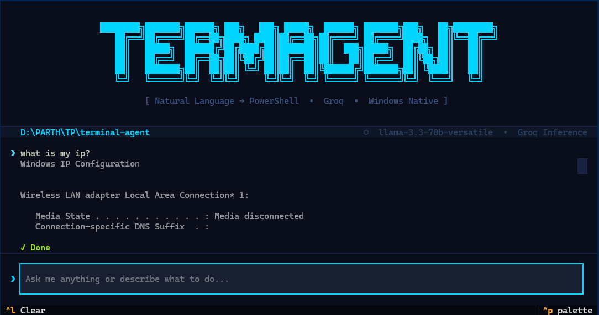
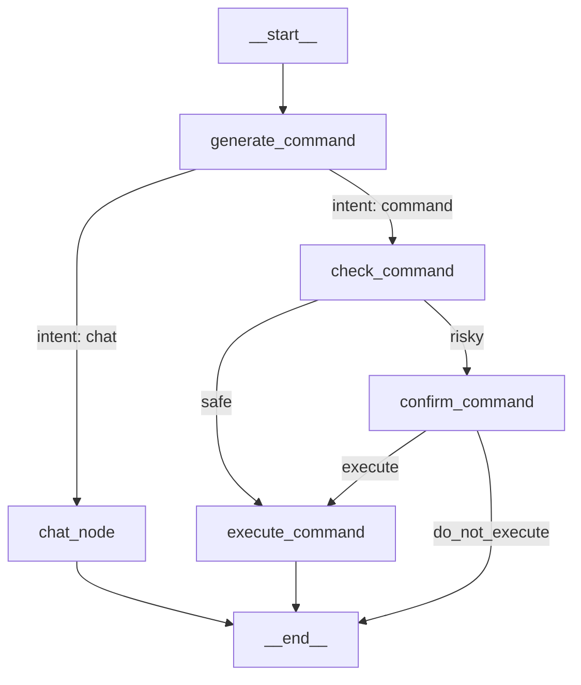

<div align="center">

# 🤖 TERMAGENT

**Your terminal, in plain English.**

[](https://python.org)
[](https://opensource.org/licenses/MIT)
[](https://github.com/langchain-ai/langgraph)
[](https://microsoft.com/powershell)

<br/>

*An AI agent for Windows that turns natural language into PowerShell commands — with safety checks, human confirmation, and a stunning terminal UI.*

</div>

---


<br/>

```powershell
❯ delete all log files older than 7 days
  ⚠ Risky command detected
  Get-ChildItem -Path . -Filter *.log | Where-Object { $_.LastWriteTime -lt (Get-Date).AddDays(-7) } | Remove-Item
  → Confirmed ✓ Done
```

<br/>

## ✨ Why Termagent?

Most developers waste time Googling half-remembered commands. Non-technical users are locked out of the terminal entirely. Termagent bridges that gap — you describe what you want, it figures out the PowerShell.

- 🔒 **Private by default** — runs on Groq
- 🪟 **Windows-native** — built for PowerShell, not an afterthought port
- 🛡️ **Safety-first** — two-layer risk detection before anything runs
- 🧠 **Actually understands context** — knows your current directory, chains multi-step operations

<br/>

## 🚀 Quick Start

Get started in under 3 minutes!

```bash
pip install termagent-cli
termagent
```

💡 *On your first run, you'll be prompted for a Groq API key. Get one free at [console.groq.com](https://console.groq.com).*

<br/>

## 🔥 Features

### 🗣️ Natural Language &rarr; PowerShell
```powershell
❯ create a folder named "api" and add a file called readme.txt inside it
  ✓ Done
```

### 🧠 Smart Intent Routing
Termagent knows the difference between a command and a question.
```powershell
❯ what is powershell?
  ◌ PowerShell is a cross-platform task automation solution...
```

### 🛡️ Two-Layer Safety System
Every command passes through:
1. **Static blacklist** — instantly blocks system-critical operations (`System32`, `regedit`, `diskpart`, remote code execution, etc.)
2. **LLM security review** — catches context-sensitive risks the blacklist can't predict

### ✋ Human-in-the-Loop (HITL)
Flagged commands never execute silently. You always get the final say.
```powershell
⚠ Risky command detected:
  Remove-Item -Path "C:\Users\..." -Recurse -Force
  Type yes to confirm or no to cancel
```

### 📂 Persistent Working Directory
Navigate freely — the agent always knows where you are.
```powershell
❯ go into the project folder
  ✓ Done
❯ create a file named notes.txt
  ✓ Done  ← created inside project/, not the root
```

<br/>

## 💾 Installation

### Requirements
- Windows (PowerShell)
- Python 3.10+
- Groq API key — free at [console.groq.com](https://console.groq.com)

### Install
```bash
pip install termagent-cli
```

### Run
```bash
termagent
```

Or without PATH setup:
```bash
python -m termagent
```

<br/>

## ⚙️ Configuration

| Variable | Description |
|:---:|---|
| `GROQ_API_KEY` | Your Groq API key (prompted on first run) |

*Termagent saves your key to a local `.env` file on first run — you won't be asked again.*

<br/>

## 📐 Architecture

Termagent is built on **[LangGraph](https://github.com/langchain-ai/langgraph)** — a stateful agent framework. The pipeline is a directed graph:



### 🛠️ Tech Stack
- **LangGraph** — agent orchestration
- **Groq** — LLM inference
- **Textual** — terminal UI framework
- **subprocess** — PowerShell execution

<br/>

## 🏗️ Project Structure

```text
termagent/
├── agent/
│   ├── graph.py     # LangGraph state machine workflow
│   ├── nodes.py     # LLM API calls, safety checks, execution logic
│   └── state.py     # AgentState TypedDict definition
└── ui.py            # Textual TUI layout + CLI entry point
```

<br/>

## ⚠️ Safety Disclaimer

> ⚠️ Termagent executes real PowerShell commands on your system. While dual-layer safety checks significantly reduce risk, always review flagged commands before confirming. The authors are not responsible for unintended system changes.

<br/>

## 🤝 Contributing

Pull requests are welcome. For major changes, open an issue first.

<br/>

## 📜 License

MIT

---
<div align="center">
  <b>Built with ❤️ for Windows users who love the terminal.</b>
</div>