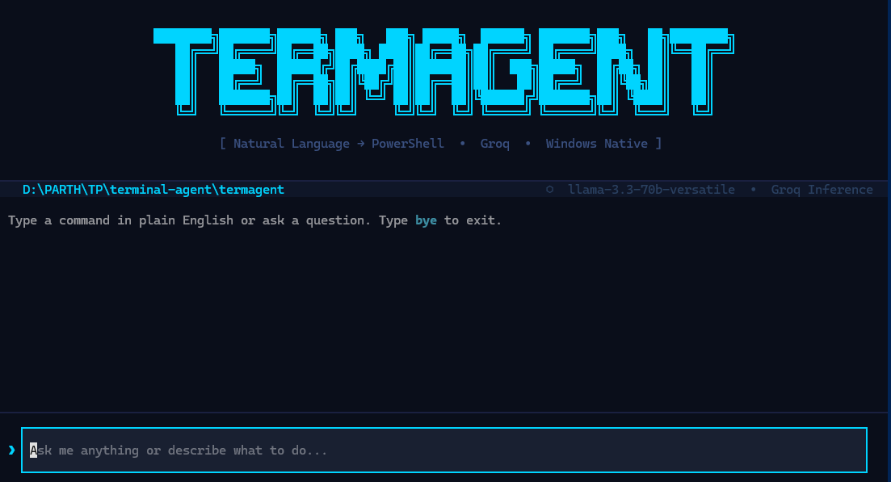
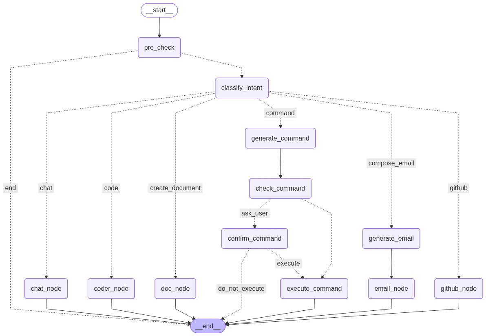
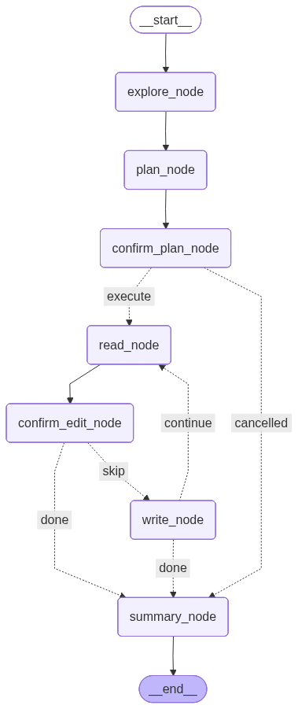

<div align="center">

# 🤖 TERMAGENT

**Your terminal, in plain English.**

[](https://python.org)
[](https://opensource.org/licenses/MIT)
[](https://github.com/langchain-ai/langgraph)
[](https://microsoft.com/powershell)
[](https://modelcontextprotocol.io)

<br/>

*An AI agent for Windows that turns natural language into PowerShell commands, documents, emails, web searches, and GitHub operations — with safety checks, human confirmation, and a stunning terminal UI.*

</div>

---


<br/>

```powershell
❯ delete all log files older than 7 days
  ⚠ Risky command detected
  Get-ChildItem -Path . -Filter *.log | Where-Object { $_.LastWriteTime -lt (Get-Date).AddDays(-7) } | Remove-Item
  → Confirmed ✓ Done
```

<br/>

## ✨ Why Termagent?

Most developers waste time Googling half-remembered commands. Non-technical users are locked out of the terminal entirely. Termagent bridges that gap — you describe what you want, and it figures out the rest.

- 🔒 **Private by default** — runs on Groq
- 🪟 **Windows-native** — built for PowerShell, not an afterthought port
- 🛡️ **Safety-first** — two-layer risk detection before anything runs
- 🧠 **Actually understands context** — knows your current directory, chains multi-step operations
- 📝 **Session Memory** — remembers conversation history throughout your session
- 🌐 **Web Search** — answers questions with real-time information from the web
- 📄 **Document Creation** — generates research reports and `.docx` files from natural language
- 🐙 **GitHub Integration** — commit, push, create releases, manage issues & PRs via MCP

<br/>

## 🚀 Quick Start

Get started in under 3 minutes!

```bash
pip install termagent-cli
termagent
```

💡 *On your first run, you'll be prompted for a Groq API key. Get one free at [console.groq.com](https://console.groq.com).*

<br/>

## 🔥 Features

### 🗣️ Natural Language &rarr; PowerShell
```powershell
❯ create a folder named "api" and add a file called readme.txt inside it
  ✓ Done
```

### 🧠 Smart Intent Routing
Termagent automatically classifies your request into the right pipeline — command, chat, email, document, or GitHub.
```powershell
❯ what is powershell?
  ◌ PowerShell is a cross-platform task automation solution...
```

### 🌐 Web Search (ReAct-Powered)
Termagent can search the web for real-time information. When you ask about current events, prices, or anything requiring up-to-date data, it automatically triggers a DuckDuckGo search and synthesizes results.
```powershell
❯ what's the latest version of Node.js?
  ◌ The latest LTS release is Node.js v22.x...
```

### 📄 Document Creation
Create comprehensive `.docx` reports directly from the terminal. Termagent searches the web, combines findings with its own knowledge, and produces a formatted Word document with headings, bullet points, tables, and more.
```powershell
❯ write a report on AI trends in 2025
  ✓ Document saved: D:\Projects\ai_trends_2025.docx
```

### 📧 Email Sending
Compose and send emails directly from the terminal — with or without attachments.
```
❯ send report.pdf to john@gmail.com
  ✓ Email sent to john@gmail.com successfully.
```
```
❯ mail the project proposal to boss@company.com with subject "Q3 Proposal"
  ✓ Email sent to boss@company.com successfully.
```
Termagent automatically composes a professional email body, signs it with your name, and attaches the file from your current working directory.

### 🐙 GitHub & Git Operations (MCP-Powered)
Full GitHub integration through the **Model Context Protocol (MCP)**. Termagent can handle both read queries and write operations:

```powershell
# Read operations
❯ show all commits
❯ list open pull requests
❯ show me the branches

# Write operations
❯ ship it
  ✓ Staged all changes → Committed → Pushed to origin → Done

❯ create an issue titled "Fix login bug"
  ✓ Issue #42 created
```

The `github_node` uses a ReAct loop with both **local git tools** (status, diff, add, commit, push, log) and **GitHub MCP tools** (PRs, issues, releases, repos, etc.) to handle any git/GitHub request autonomously.

### 🛡️ Two-Layer Safety System
Every command passes through:
1. **Static blacklist** — instantly blocks system-critical operations (`System32`, `regedit`, `diskpart`, remote code execution, etc.)
2. **LLM security review** — catches context-sensitive risks the blacklist can't predict

### ✋ Human-in-the-Loop (HITL)
Flagged commands never execute silently. You always get the final say.
```powershell
⚠ Risky command detected:
  Remove-Item -Path "C:\Users\..." -Recurse -Force
  Type y to confirm or n to cancel
```

### 📂 Persistent Working Directory
Navigate freely — the agent always knows where you are.
```powershell
❯ go into the project folder
  ✓ Done
❯ create a file named notes.txt
  ✓ Done  ← created inside project/, not the root
```

### 🧠 Session Memory
Termagent retains the conversation history throughout a session. You can naturally refer to previous commands and context without repeating yourself.

### ❗ Raw PowerShell Mode
Bypass the agent entirely with the `!` prefix for direct PowerShell execution.
```powershell
❯ !Get-Process | Sort-Object CPU -Descending | Select-Object -First 5
```

<br>

## 📐 Agent Architecture

Termagent is built on **[LangGraph](https://github.com/langchain-ai/langgraph)**. The stateful pipeline uses DAG architecture with along with ReAct loop to manage tool selection and execution safety where the task is assigned as per different agent's capabilities.



### Coder Node Architecture


### Node Descriptions

| Node | Purpose |
|:---|:---|
| `pre_check` | Short-circuits email requests when credentials are missing (avoids LLM call) |
| `classify_intent` | LLM-powered intent classification → `command`, `chat`, `email`, `document`, or `github` |
| `generate_command` | Translates natural language to a PowerShell command |
| `check_command` | Dual-layer safety (blacklist + LLM review) |
| `confirm_command` | Human-in-the-loop confirmation for risky commands |
| `execute_command` | Runs the PowerShell command and captures output + working directory |
| `chat_node` | ReAct loop with web search and file reading tools |
| `generate_email` | Composes a professional email with structured output |
| `email_node` | Sends the email via Gmail SMTP with optional attachments |
| `doc_node` | ReAct loop — researches via web search, generates `.docx` documents |
| `github_node` | ReAct loop — local git tools + GitHub MCP tools for all git/GitHub operations |


## 💾 Installation

### Requirements
- Windows (PowerShell)
- Python 3.10+
- Groq API key — free at [console.groq.com](https://console.groq.com)
- Node.js (required for GitHub MCP server — `npx`)

### Install
```bash
pip install termagent-cli
```

### Run
```bash
termagent
```

Or without PATH setup:
```bash
python -m termagent
```

<br/>

## ⚙️ Configuration

| Variable | Description |
|:---:|---|
| `GROQ_API_KEY` | Your Groq API key (prompted on first run) |
| `EMAIL_ADDRESS` | Your Gmail address for sending emails (optional) |
| `EMAIL_PASSWORD` | Gmail App Password — get one at [myaccount.google.com/apppasswords](https://myaccount.google.com/apppasswords) (optional) |
| `EMAIL_USERNAME` | Your name, used for email signatures (optional) |
| `GITHUB_PERSONAL_ACCESS_TOKEN` | GitHub PAT with `repo`, `read:user` scopes — get one at [github.com/settings/tokens](https://github.com/settings/tokens) (optional) |

*Termagent saves your keys, passwords, and credentials to a local `.env` file on first run — you won't be asked again.*

<br/>

### 🛠️ Tech Stack

| Technology | Role |
|:---|:---|
| **LangGraph** | Agent orchestration & state machine |
| **Groq** | LLM inference (llama-3.3-70b & gpt-oss-120b) |
| **Model Context Protocol (MCP)** | GitHub API integration |
| **DuckDuckGo Search** | Real-time web search |
| **Textual** | Terminal UI framework |
| **python-docx** | `.docx` document generation |
| **pdfplumber** | PDF file reading |
| **Pydantic** | Structured LLM output parsing |
| **subprocess** | PowerShell & git execution |

<br/>

## 🏗️ Project Structure

```text
termagent/
├── agent/
│   ├── graph.py       # LangGraph state machine — nodes, edges, conditional routing
│   ├── nodes.py       # All agent nodes — intent classification, command gen, chat, email, docs, GitHub
│   ├── state.py       # AgentState TypedDict definition
│   ├── tools.py       # Tool implementations — web search, document read/write, markdown→docx converter
│   └── mcp_client.py  # GitHub MCP client — async tool calls, dynamic LangChain tool creation, git helpers
└── ui.py              # Textual TUI — layout, input handling, HITL confirmation, spinner, output rendering
```

<br/>

## ⚠️ Safety Disclaimer

> ⚠️ Termagent executes real PowerShell commands on your system. While dual-layer safety checks significantly reduce risk, always review flagged commands before confirming. The authors are not responsible for unintended system changes.

<br/>

## 🤝 Contributing

Pull requests are welcome. For major changes, open an issue first.

<br/>

## 📜 License

MIT

---
<div align="center">
  <b>Built with ❤️ for Windows users who love the terminal.</b>
</div>